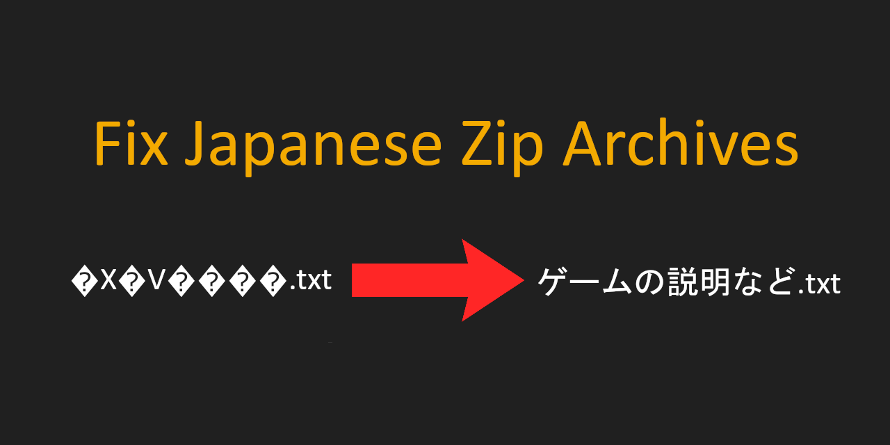

# Unzip JP GUI

Unzip Japanese Shift-JIS zip archives on non-Japanese systems. This script unzips the file while converting the file names from Shift-JIS to UTF-8.

Japanese versions of Windows use Shift-JIS encoding to store file names. When a zip file is created from files containing Japanese characters and later opened on a non-Japanese system, the file names are [scrambled](https://en.wikipedia.org/wiki/Mojibake). This program aims to fix that problem.


## Usage/Examples

Run the program as described in [Run Locally](#run-locally).

  
## Run Locally

### Express

Download the latest exe file from the [release tab](https://github.com/saberzero1/unzip-jp-gui/releases) and execute it.

### Manual

Ensure you have TKinter installed if you want to run the file manually.

#### On windows:

```
python pip install tk
```

#### On Linux:

```
sudo apt-get install python3-tk 
```

execute the following command in Command Prompt from the folder
```
python archive_gui.py
```
## Acknowledgements

 - [Norbert Pozar](https://github.com/rekka/unzip-jp)
